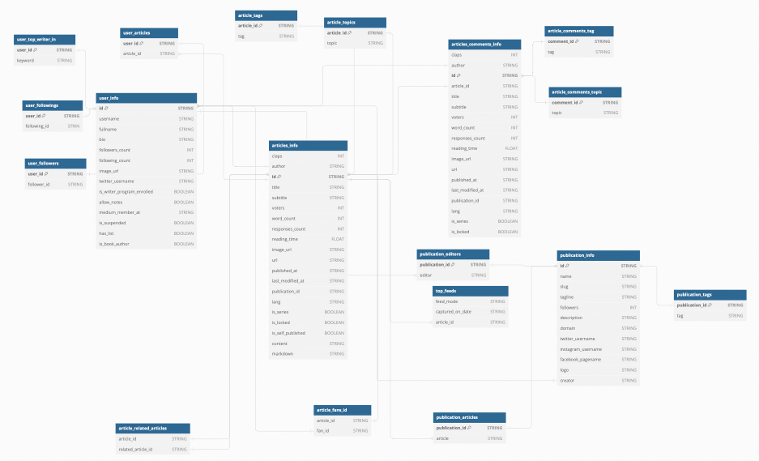

# Medium Data Extraction
This project extracts data from the Medium platform, focusing on top writers, articles, publications, and feeds related 
to a specified topic. The extracted data is then stored in `data/api_medium_catalog` and there is an option to store in 
a Google BigQuery database. 
## Project Structure

The project is structured as a Kedro pipeline, where each node in the pipeline corresponds to a specific data extraction
task. The pipeline consists of the following main components:
* ### Nodes:
* `initialize_medium`: Initializes a Medium instance using the provided API key.
* `fetch_top_writers`: Fetches a list of top writers for a specified topic.
* `extract_users`: Extracts user information, followers, followings, and articles from top writers.
* `fetch_user_articles_info`: Fetches detailed information about articles authored by top writers.
* `fetch_publications_info`: Fetches information about Medium publications related to a given topic.
* `fetch_top_feeds`: Fetches information about Medium top feeds for a specified topic.

#### Localisation of node.py: `/src/api_medium/pipelines/data_processing/nodes.py`.
#### Localisation of pipeline.py: `/src/api_medium/pipelines/data_processing/pipeline.py`.

* ### Data Catalog:
The data catalog is defined in `catalog.yml`, specifying the data sets and their types and file paths. 
These datasets include information about users, articles, publications, and top feeds.
```yml
# Example of specified dataset:
users_info_df:
   type: pandas.CSVDataSet
   filepath: data/api_medium_catalog/users_info.csv
```
* ### Parameters:
The `parameters.yml` file contains configuration parameters for the project, including API key, topic, count, Google 
Cloud configurations, and more.
```yml
# Example of specified dataset:
api_key: YOUR_MEDIUM_API_KEY
topic_slug: llm
count: 10
load_to_bq: True
feed_mode:
  - hot
  - new
  - top_year
  - top_month
  - top_week
  - top_all_time
google_cloud_config:
  project: YOUR-PROJECT-ID
  dataset_id: YOUR-DATASET-ID
  # Here are defined bigquery tables
  credentials_path: credentials/credentials.json # Path to your json key
```
* ### Database Schema:
The extracted data is stored in a Google BigQuery database. The database schema includes tables for user information, 
articles, publications, and top feeds. For a detailed overview, refer to the database diagram:

[Database_schema](https://dbdiagram.io/d/Medium_API-db_schema-65abf44aac844320ae581cd5)



## Selecting most relevant tag
Because cannot find Publication's Newsletter info in Medium API docs. I choose to shortening
description of publication and also searching most relevant tag in publication info not in newsletter.
```python
# Lines from 422 to 427:
# Selecting most relevant tag for publication
        words = re.findall(r'\b\w+\b', publication_info['description'].lower())
        hashtag_relevance = Counter()
        for tag in publication_tags:
            hashtag_relevance[tag] = sum(1 for word in words if word.lower() in tag.lower())
        publication_info['most_relevant_tag'] = hashtag_relevance.most_common(1)[0][0]
```

## Shortening description to 5 words

This code uses the RapidAPI Text Summarization service to summarize a given text and then extracts the most 
representative sentence from the summary. 

Unfortunately, I did not find an NLP model that would summarize the text in 5 words, so I used the code to find the 
shortest description from the 5 proposals proposed by the API.

```python
import requests

url = "https://textanalysis-text-summarization.p.rapidapi.com/text-summarizer-text"

payload = {
	"text": "TEXT_TO_SUMMARIZE",
	"sentnum": "5"
}
headers = {
	"content-type": "application/x-www-form-urlencoded",
	"X-RapidAPI-Key": "RAPID-API-KEY", # From RapidAPI: https://rapidapi.com/textanalysis/api/text-summarization
	"X-RapidAPI-Host": "textanalysis-text-summarization.p.rapidapi.com"
}

response = requests.post(url, data=payload, headers=headers)

summarized_description = min(response.json()['sentences'], key=len)
```
## Project requirements

Project requirements saved in `src/requirements.txt`.

## Loading to BigQuery

The `load_to_bq` parameter in `parameters.yml` allows you to control whether to load the extracted data into BigQuery. 
Set `load_to_bq`: `False` if you want to skip the loading step.

```yml
# parameters.yml
load_to_bq: True  # Set to False if you do not want to load to BigQuery
```
Ensure that your Google Cloud credentials are stored in credentials/credentials.json. If `load_to_bq` is set to True, 
the pipeline will use `pandas_gbq` to upload the CSV files to BigQuery.

## Running kedro dockerized:
### 1. Adjust Dockerfile:
Adjust Docker file localized in `src/Dockerfile`:
```Dockefile
FROM python:3.10

COPY conf /api-medium/conf
COPY data /api-medium/data
COPY info.log /api-medium/info.log
COPY pyproject.toml /api-medium/pyproject.toml
COPY credentials /api-medium/credentials
COPY docs /api-medium/docs
COPY notebooks /api-medium/notebooks
COPY src /api-medium/src

WORKDIR /api-medium/src

RUN pip install --no-cache-dir -r requirements.txt

EXPOSE 8888

WORKDIR /api-medium

CMD ["kedro", "run"]
```
Make sure you have a requirements.txt file in your project directory that includes all the necessary dependencies for your Kedro project.
### 2. Build the Docker image:
Open a terminal in your project directory and run:
```bash
docker build -t api_medium_kedro_image .
```

### 3. Run Kedro in Docker container:
Once the image is built, you can run your Kedro project within a Docker container:
```bash
docker run -it -p 8888:8888 --name api_medium_kedro_container api_medium_kedro_image
```